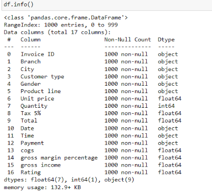
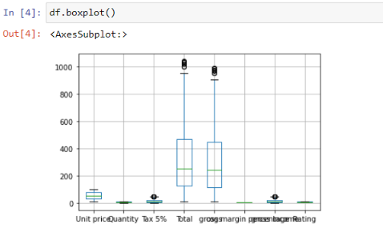
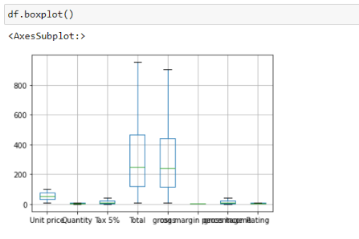
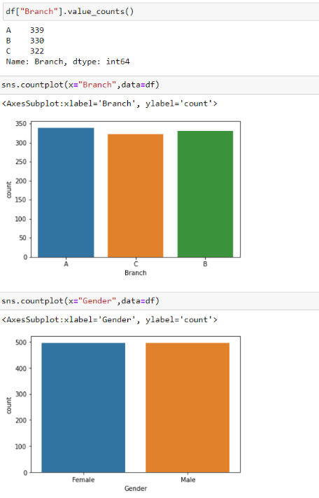
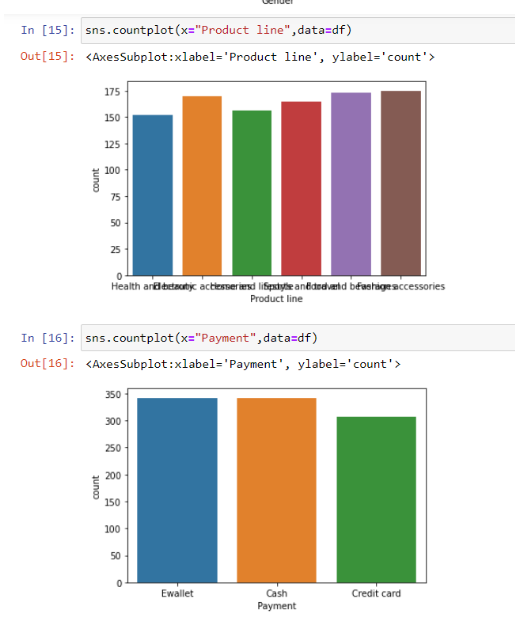
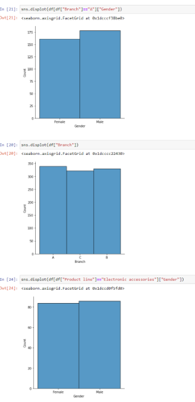
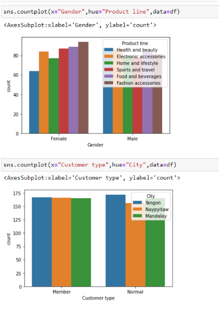
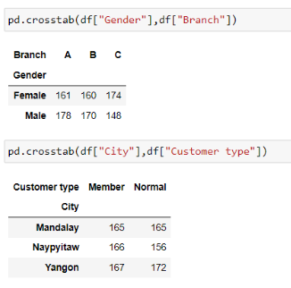
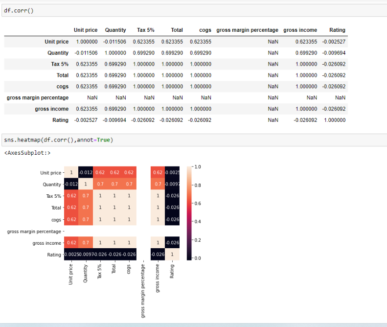

# Ex-04-EDA

## AIM
To perform EDA on the given data set.

## Explanation
The primary aim with exploratory analysis is to examine the data for distribution, outliers and anomalies to direct specific testing of your hypothesis.

## ALGORITHM
### STEP 1
Import the required packages(pandas,numpy,seaborn).

### STEP 2
Read and Load the Dataset

### STEP 3
Remove the null values from the data and remove the outliers.

### STEP 4
Remove the non numerical data columns using drop() method.

### STEP 5:
returns object containing counts of unique values using (value_counts()).

### STEP 6:
Plot the counts in the form of Histogram or Bar Graph.

### STEP 7:
find the pairwise correlation of all columns in the dataframe(.corr()).

### STEP 8:
Save the final data set into the file.

## CODE
```
import pandas as pd
import numpy as np
import seaborn as sns
df=pd.read_csv("supermarket.csv")
df.info()
df.isnull().sum()
df.boxplot()
Q1 = df.quantile(0.25)
Q3 = df.quantile(0.75)
IQR = Q3 - Q1
df = df[~((df < (Q1 - 1.5 * IQR)) |(df > (Q3 + 1.5 * IQR))).any(axis=1)]
df.boxplot()
df["City"].value_counts()
df["Customer type"].value_counts()
df["Gender"].value_counts()
df["Product line"].value_counts()
df["Payment"].value_counts()
df["Branch"].value_counts()
sns.countplot(x="Branch",data=df)
sns.countplot(x="Gender",data=df)
sns.countplot(x="Product line",data=df)
sns.countplot(x="Payment",data=df)
sns.countplot(x="Gender",hue="Product line",data=df)
sns.countplot(x="Customer type",hue="City",data=df)
sns.displot(df[df["Branch"]=="A"]["Gender"])
sns.displot(df["Branch"])
sns.displot(df[df["Product line"]=="Electronic accessories"]["Gender"])
sns.displot(df[df["Payment"]=="Credit card"]["Branch"])
pd.crosstab(df["Gender"],df["Branch"])
pd.crosstab(df["City"],df["Customer type"])
df.corr()
sns.heatmap(df.corr(),annot=True)
```
## OUTPUT









## RESULT
The data has been cleaned, outlier has been removed and the EDA on the given data has been performed.